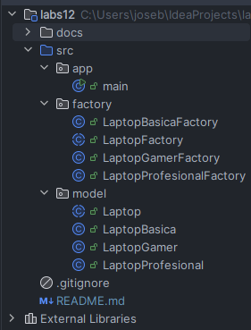
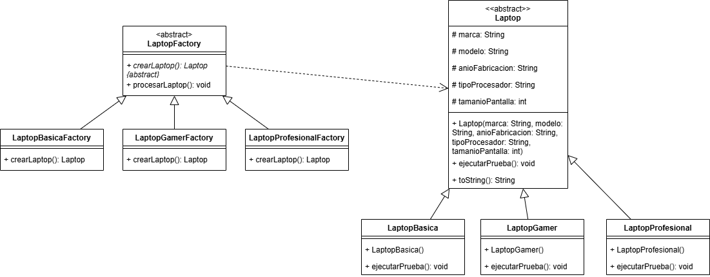
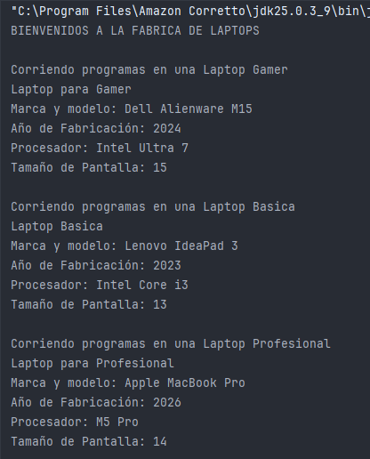

# Factory Method - Creación de Laptops

## Descripción

En este laboratorio se implementó el patrón de diseño **Factory Method** utilizando como ejemplo la creación de distintos tipos de laptops. El sistema cuenta con tres categorías:

* Laptop Básica
* Laptop Gamer
* Laptop Profesional

Cada una tiene una configuración diferente, como la marca, modelo, año de fabricación, procesador y tamaño de pantalla. Además, cada tipo de laptop ejecuta una prueba distinta para demostrar el uso del polimorfismo.

---

# Caso de estudio

Se planteó el desarrollo de un sistema donde existen diferentes tipos de laptops. Aunque todas comparten las mismas características generales, cada una tiene una configuración propia y un comportamiento diferente al momento de ejecutar una prueba.

En lugar de crear los objetos directamente desde el programa principal utilizando `new`, se decidió aplicar el patrón **Factory Method**, delegando la responsabilidad de crear cada laptop a una fábrica específica.

De esta manera, el código principal solo necesita trabajar con la fábrica correspondiente sin conocer cómo se construye cada objeto.

---

# ¿Por qué se utilizó Factory Method?

Se utilizó este patrón porque permite separar la creación de los objetos del resto del programa.

Cada fábrica es responsable de crear un único tipo de laptop:

* `LaptopBasicaFactory`
* `LaptopGamerFactory`
* `LaptopProfesionalFactory`

Gracias a esto, el código queda más organizado y resulta más sencillo agregar nuevos tipos de laptops en el futuro sin modificar la lógica del programa principal.

Además, la clase `LaptopFactory` define el método `crearLaptop()`, mientras que las fábricas concretas implementan dicho método devolviendo el objeto correspondiente.

---

# Estructura del proyecto

---

# Funcionamiento

El programa crea una fábrica dependiendo del tipo de laptop que se desea utilizar.

Luego, la fábrica crea automáticamente el objeto correspondiente mediante el método `crearLaptop()`. Finalmente, el método `procesarLaptop()` ejecuta la prueba de la laptop creada.

Con este enfoque el programa principal no necesita conocer las clases concretas, ya que toda la creación de objetos queda encapsulada dentro de las fábricas.

---

# Beneficios obtenidos

* Se desacopló la creación de los objetos del programa principal.
* Cada fábrica tiene una única responsabilidad.
* El código es más fácil de mantener y entender.
* Es posible agregar nuevos tipos de laptops creando una nueva fábrica y una nueva clase de laptop, sin modificar las existentes.
* Se aprovechó el polimorfismo al trabajar siempre con la clase abstracta `Laptop`.

---

# Diagrama de clases

---

# Salida del programa

---

# Conclusiones

La implementación del patrón **Factory Method** permitió organizar mejor el código y separar la creación de los objetos de su utilización. Esto hace que el sistema sea más flexible y facilita futuras ampliaciones, ya que cada tipo de laptop se crea mediante su propia fábrica sin afectar el funcionamiento del resto del programa.
